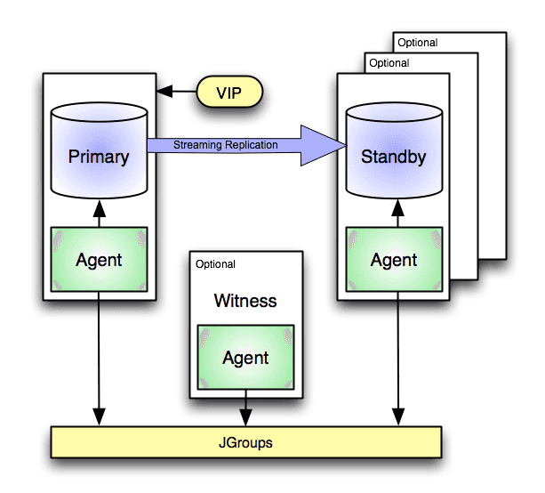

# EDB Failover Manager demo (WIP)

## Intro
This demo is deployed using Vagrant and will deploy the following nodes:

| Name | IP | Cluster | Task | Remarks |
| -------- | -------- | ----- | -------- | -------- |
| witness | 192.168.56.10 | TBD | EFM witness |  |
| primary | 192.168.56.11 | TBD | Postgres Primary | |
| replica| 192.168.56.12 | TBD | Replica of Primary |  |

## Demo prep
### Pre-requisites
To deploy this demo the following needs to be installed in the PC from which you are going to deploy the demo:

- VirtualBox (https://www.virtualbox.org/)
- Vagrant (https://www.vagrantup.com/)
- Vagrant Hosts plug-in (`vagrant plugin install vagrant-hosts`)
- A file called `.edbtoken` with your EDB repository 2.0 token. This token can be found in your EDB account profile here: https://www.enterprisedb.com/accounts/profile

The environment is deloyed in a VirtualBox provate network. Adjust the IP addresses to your needs in `vars.yml`.

The EFM cluster which is created is called `dontknowyet`. 

Status of the EFM cluster can be shown using `/usr/edb/efm-4.8/bin/efm cluster-status pgcluster` from `primary` and as user `efm`.

### Provisioning VM's.
Provision the hosts using `vagrant up`. This will create the bare virtual machines and will take appx. 5 minutes to complete. 

After provisioning, the hosts will have the current directory mounted in their filesystem under `/vagrant`

*It is recommended to reboot (`00-reboot.sh`) the three servers after provisioning since a lot of updates have been insalled.*

### Configuring software

| Step | Server | Action | User | Script | Remarks |
| -------- | -------- | ----- | -------- | -------- | ------ |
| 0 | Local PC | Reboot all servers | Local user | `00-reboot.sh` | Optional but recommended |
| 1 | Primary | Configure replication | enterprisedb | `01-configureReplicationPrimary.sh` |  |
| 2 |  |  |  |  |  |
| 3 |  |  |  |  |  |

### Passwords

### Configuring pgbench
The provisioning script initializes Pgbench into the `postgres` database on `pg1` and creates a 30 min schedule cron to run pgbench on this database. 

## Extra
### Configuring EFM in PEM
Deploy the PEM agent into the three servers using `10-deployPEMagent.sh`.
Register the servers in PEM using `11-registerPEMagents.sh`.
After registering the agents in PEM, discoonect the servers and add the EFM parameters to the advanced properties of the agents. 
```
EFM cluster name : TBD
EFM installation path : /usr/edb/efm-4.8/bin/
```
Now that we are in the agent configuration it is also a good idea to add the serviceID to the agent configuration. Since we are using EDB Postgres Advanced Server 15, the ServiceID is `edb-as-15`.

You can check the EFM cluster status by doing the following:
```
$ vagrant ssh pg1
Last login: Thu Apr  4 09:58:00 2024 from 10.0.2.2
[vagrant@pg1 ~]$ sudo su - efm
Last login: Thu Apr  4 11:01:25 UTC 2024 on pts/0
[efm@pg1 ~]$ /usr/edb/efm-4.8/bin/efm cluster-status pgcluster
Cluster Status: pgcluster

	Agent Type  Address              DB       VIP
	----------------------------------------------------------------
	Primary     192.168.0.211        UP
	Standby     192.168.0.212        UP
	Witness     192.168.0.213        N/A

Allowed node host list:
	192.168.0.213 192.168.0.211 192.168.0.212 192.168.0.214

Membership coordinator: 192.168.0.213

Standby priority host list:
	192.168.0.212

Promote Status:

	DB Type     Address              WAL Received LSN   WAL Replayed LSN   Info
	---------------------------------------------------------------------------
	Primary     192.168.0.211                           0/DCB2048
	Standby     192.168.0.212        0/DCB2048          0/DCB2048

	Standby database(s) in sync with primary. It is safe to promote.
```

### Enable all probes
To be able to show all use cases you have to enable extra probes:
- In the top menu, select `Management / Manage Probes...`
- Click `manage Custom Probes` and switch `Show System Probes?` to On.
- Enable all probes except `xDB Replication` and the `PGD` probes. We are not using PGD here (yet?).
- Make sure you click the `Save` icon at the top of the table.

## Demo cleanup
To clean up the demo environment you just have to run `99-deprovision.sh`. This script will remove the virtual machines and the cluster configuration.

## TODO / To fix
